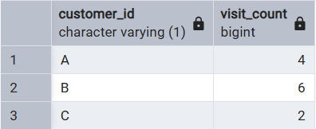

# Case Study #1: Danny's Diner Solutions

This document provides the SQL queries and explanations for the business questions asked in the Danny's Diner case study.

---

### 1. What is the total amount each customer spent at the restaurant?

**Query:**

```sql
SELECT
    s.customer_id,
    SUM(m.price) AS total_spent
FROM
    sales AS s
    JOIN menu AS m ON s.product_id = m.product_id
GROUP BY
    s.customer_id
ORDER BY
    s.customer_id;
```

**Output:**


**Explanation:**
To calculate the total amount spent, I joined the `sales` and `menu` tables using `product_id`. I then grouped the results by `customer_id` and used the `SUM()` aggregate function on the `price` column.

---

### 2. How many days has each customer visited the restaurant?

**Query:**

```sql
SELECT
    customer_id,
    COUNT(DISTINCT order_date) AS visit_count
FROM
    sales
GROUP BY
    customer_id;
```

**Output:**



**Explanation:**
I used `COUNT(DISTINCT order_date)` to ensure that even if a customer ordered multiple times on the same day, it would only be counted as a single visit day. The results were then grouped by `customer_id`.

---

### 3. What was the first item from the menu purchased by each customer?

**Query:**

```sql
WITH customer_first_purchase AS (
    SELECT
        s.customer_id,
        m.product_name,
        s.order_date,
        ROW_NUMBER() OVER(
            PARTITION BY s.customer_id
            ORDER BY
                s.order_date
        ) AS purchase_rank
    FROM
        sales AS s
        JOIN menu AS m ON s.product_id = m.product_id
)
SELECT
    customer_id,
    product_name
FROM
    customer_first_purchase
WHERE
    purchase_rank = 1;
```

**Output:**


**Explanation:**
I used a Common Table Expression (CTE) with the `ROW_NUMBER()` window function. The function ranks each customer's purchases chronologically by partitioning by `customer_id` and ordering by `order_date`. The final query then selects only the items with a rank of 1.

---

### 4. What is the most purchased item on the menu and how many times was it purchased?

**Query:**

```sql
SELECT
    m.product_name,
    COUNT(s.product_id) AS times_purchased
FROM
    sales AS s
    JOIN menu AS m ON s.product_id = m.product_id
GROUP BY
    m.product_name
ORDER BY
    times_purchased DESC
LIMIT
    1;
```

**Output:**


**Explanation:**
This query counts the occurrences of each `product_name` after joining `sales` and `menu`. It then orders the results in descending order of the count and uses `LIMIT 1` to retrieve only the top item.

---

### 5. Which item was the most popular for each customer?

**Query:**

```sql
WITH item_popularity AS (
    SELECT
        s.customer_id,
        m.product_name,
        COUNT(s.product_id) AS purchase_count,
        DENSE_RANK() OVER(
            PARTITION BY s.customer_id
            ORDER BY
                COUNT(s.product_id) DESC
        ) AS ranking
    FROM
        sales AS s
        JOIN menu AS m ON s.product_id = m.product_id
    GROUP BY
        s.customer_id,
        m.product_name
)
SELECT
    customer_id,
    product_name,
    purchase_count
FROM
    item_popularity
WHERE
    ranking = 1;
```

**Output:**


**Explanation:**
I first created a CTE that counts how many times each customer purchased each item. Then, I used the `DENSE_RANK()` window function to rank these items for each customer based on the purchase count. The final query filters for items where the rank is 1.

---

### 6. Which item was purchased first by a customer after they became a member?

**Query:**

```sql
WITH member_first_purchase AS (
    SELECT
        s.customer_id,
        s.order_date,
        m.product_name,
        DENSE_RANK() OVER(
            PARTITION BY s.customer_id
            ORDER BY
                s.order_date
        ) AS purchase_rank
    FROM
        sales AS s
        JOIN menu AS m ON s.product_id = m.product_id
        JOIN members AS mem ON s.customer_id = mem.customer_id
    WHERE
        s.order_date >= mem.join_date
)
SELECT
    customer_id,
    order_date,
    product_name
FROM
    member_first_purchase
WHERE
    purchase_rank = 1;
```

**Output:**


**Explanation:**
This query joins all three tables and filters the sales to include only those that occurred on or after the customer's `join_date`. A CTE with `DENSE_RANK()` is then used to find the first purchase within this filtered set.

---

### 7. Which item was purchased just before a customer became a member?

**Query:**

```sql
WITH pre_member_purchase AS (
    SELECT
        s.customer_id,
        s.order_date,
        m.product_name,
        ROW_NUMBER() OVER(
            PARTITION BY s.customer_id
            ORDER BY
                s.order_date DESC
        ) AS purchase_rank
    FROM
        sales AS s
        JOIN menu AS m ON s.product_id = m.product_id
        JOIN members AS mem ON s.customer_id = mem.customer_id
    WHERE
        s.order_date < mem.join_date
)
SELECT
    customer_id,
    product_name
FROM
    pre_member_purchase
WHERE
    purchase_rank = 1;
```

**Output:**


**Explanation:**
Similar to the previous question, this query filters for purchases made _before_ the `join_date`. The key difference is ordering the rank by date in `DESC` order to find the most recent purchase before membership.

---

### 8. What is the total items and amount spent for each member before they became a member?

**Query:**

```sql
SELECT
    s.customer_id,
    COUNT(s.product_id) AS total_items,
    SUM(m.price) AS total_spent
FROM
    sales AS s
    JOIN menu AS m ON s.product_id = m.product_id
    JOIN members AS mem ON s.customer_id = mem.customer_id
WHERE
    s.order_date < mem.join_date
GROUP BY
    s.customer_id
ORDER BY
    s.customer_id;
```

**Output:**


**Explanation:**
This is an aggregation query that joins the three tables, filters for sales before the `join_date`, and then groups by `customer_id` to calculate the `COUNT` of items and `SUM` of the price.

---

### 9. If each $1 spent equates to 10 points and sushi has a 2x points multiplier, how many points would each customer have?

**Query:**

```sql
SELECT
    s.customer_id,
    SUM(
        CASE
            WHEN m.product_name = 'sushi' THEN m.price * 20
            ELSE m.price * 10
        END
    ) AS total_points
FROM
    sales AS s
    JOIN menu AS m ON s.product_id = m.product_id
GROUP BY
    s.customer_id
ORDER BY
    s.customer_id;
```

**Output:**


**Explanation:**
I used a `CASE` statement to apply conditional logic for point calculation. If the item is 'sushi', the price is multiplied by 20; otherwise, it's multiplied by 10. The `SUM` function then totals these points for each customer.

---

### 10. In the first week after a customer joins, they earn 2x points on all items. How many points do customer A and B have at the end of January?

**Query:**

```sql
SELECT
    s.customer_id,
    SUM(
        CASE
            WHEN s.order_date BETWEEN mem.join_date AND (mem.join_date + INTERVAL '6 day') THEN m.price * 20
            WHEN m.product_name = 'sushi' THEN m.price * 20
            ELSE m.price * 10
        END
    ) AS total_points
FROM
    sales AS s
    JOIN menu AS m ON s.product_id = m.product_id
    JOIN members AS mem ON s.customer_id = mem.customer_id
WHERE
    s.customer_id IN ('A', 'B')
    AND s.order_date <= '2021-01-31'
GROUP BY
    s.customer_id
ORDER BY
    s.customer_id;
```

**Output:**


**Explanation:**
This query adds another layer to the `CASE` statement logic. It first checks if a purchase was made within the 7-day promotional period after joining. If so, it applies a 20x multiplier. If not, it falls back to the previous logic of checking for sushi. The `WHERE` clause filters for the specific customers and timeframe.

---

## Bonus Questions

### Join All The Things

**Query:**

```sql
SELECT
    s.customer_id,
    s.order_date,
    m.product_name,
    m.price,
    CASE
        WHEN s.order_date >= mem.join_date THEN 'Y'
        ELSE 'N'
    END AS member
FROM
    sales AS s
    JOIN menu AS m ON s.product_id = m.product_id
    LEFT JOIN members AS mem ON s.customer_id = mem.customer_id
ORDER BY
    s.customer_id,
    s.order_date;
```

**Explanation:**
A `LEFT JOIN` is used from `sales` to `members` to ensure all sales are included, even for non-members like Customer C. A `CASE` statement then checks if the `order_date` is on or after the `join_date` to determine the membership status at the time of purchase.

---

### Rank All The Things

**Query:**

```sql
WITH customer_summary AS (
    SELECT
        s.customer_id,
        s.order_date,
        m.product_name,
        m.price,
        CASE
            WHEN s.order_date >= mem.join_date THEN 'Y'
            ELSE 'N'
        END AS member
    FROM
        sales AS s
        JOIN menu AS m ON s.product_id = m.product_id
        LEFT JOIN members AS mem ON s.customer_id = mem.customer_id
)
SELECT
    *,
    CASE
        WHEN member = 'N' THEN NULL
        ELSE DENSE_RANK() OVER (
            PARTITION BY
                customer_id,
                member
            ORDER BY
                order_date
        )
    END AS ranking
FROM
    customer_summary
ORDER BY
    customer_id,
    order_date;
```

**Explanation:**
This query builds on the previous one by first creating a CTE with the membership status. The final `SELECT` statement then uses another `CASE` statement to apply a `DENSE_RANK()` only to the rows where a customer was a member (`member = 'Y'`), leaving the rank as `NULL` for all other purchases.
