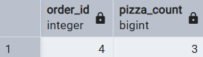
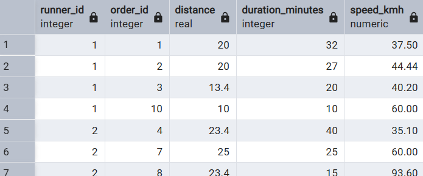
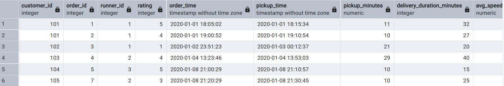

# Case Study #2: Pizza Runner - Complete Analysis

This document presents a comprehensive, step-by-step solution to the Pizza Runner case study. It details the critical data cleaning steps required before any analysis could be performed, followed by the solutions to all business questions across sections A, B, C, and D, including the bonus questions.

## Part 1: Data Cleaning & Preparation

Before any analysis could be performed, the raw data required significant cleaning to ensure accuracy and usability. This process is crucial as it mimics a real-world scenario where data is rarely perfect.

### Cleaning `customer_orders`

**Query:**

```sql
-- Create a new table with clean data
CREATE TABLE customer_orders_clean AS
SELECT
    order_id,
    customer_id,
    pizza_id,
    CASE
        WHEN exclusions = '' OR exclusions = 'null' THEN NULL
        ELSE exclusions
    END AS exclusions,
    CASE
        WHEN extras = '' OR extras = 'null' THEN NULL
        ELSE extras
    END AS extras,
    order_time
FROM
    customer_orders;
```


**Explanation:**

The exclusions and extras columns in the customer_orders table used a mix of empty strings ('') and the word `'null'` to represent orders without modifications. This is problematic because it makes it difficult to accurately filter or count these orders. To fix this, I created a new, clean table called `customer_orders_clean`. This is a safe practice that keeps the original raw data for reference. I used a CASE statement to check each row and convert the messy values into proper NULLs.

### Cleaning `runner_orders`

**Query:**

```sql
-- Clean `pickup_time` by converting it to a TIMESTAMP
UPDATE runner_orders SET pickup_time = NULL WHERE pickup_time = 'null';
ALTER TABLE runner_orders ALTER COLUMN pickup_time TYPE TIMESTAMP USING (pickup_time::timestamp);

-- Clean `distance` by removing "km" and converting it to a number
UPDATE runner_orders SET distance = NULL WHERE distance = 'null';
UPDATE runner_orders SET distance = TRIM('km' FROM distance);
ALTER TABLE runner_orders ALTER COLUMN distance TYPE REAL USING (distance::real);

-- Clean `duration` by removing "minute" variations and converting it to a number
UPDATE runner_orders SET duration = NULL WHERE duration = 'null';
UPDATE runner_orders SET duration = REPLACE(duration, 'minutes', '');
UPDATE runner_orders SET duration = REPLACE(duration, 'minute', '');
UPDATE runner_orders SET duration = REPLACE(duration, 'mins', '');
ALTER TABLE runner_orders ALTER COLUMN duration TYPE INT USING (duration::integer);

-- Clean `cancellation` by standardizing missing values to NULL
UPDATE runner_orders SET cancellation = NULL WHERE cancellation = 'null' OR cancellation = '';

```


**Explanation:**

The `runner_orders` table had several issues that would cause errors in calculations. The `pickup_time`, `distance`, and `duration` columns were stored as text (`VARCHAR`) instead of numbers or timestamps. They also contained extra characters like `'km'` and `'minutes'`. To solve this, I cleaned the table _in-place_ by fixing one column at a time. I used `UPDATE` to remove unwanted text and standardize NULLs, and then `ALTER TABLE` to change each column's data type to the correct one (e.g., `TIMESTAMP`, `INTEGER`, `REAL`).

---

## A. Pizza Metrics

### 1. How many pizzas were ordered?

**Query:**

```sql
SELECT COUNT(*) AS total_pizzas_ordered
FROM customer_orders_clean;
```


**Explanation:**
To find the total number of pizzas, I simply counted every row in the `customer_orders_clean` table. Since each row represents one pizza, the `COUNT(*)` function gives the grand total.

---

### 2. How many unique customer orders were made?

**Query:**

```sql
SELECT COUNT(DISTINCT order_id) AS unique_orders FROM customer_orders_clean;
```


**Explanation:**
A single order can contain multiple pizzas, but they all share the same `order_id`. To count only the unique orders, I used `COUNT(DISTINCT order_id)`, which tells SQL to count each unique `order_id` only one time.

---

### 3. How many successful orders were delivered by each runner?

**Query:**

```sql

SELECT runner_id, COUNT(order_id) AS successful_orders
FROM runner_orders
WHERE cancellation IS NULL
GROUP BY runner_id ORDER BY runner_id;
```


**Explanation:**

A successful order is one that was not cancelled. In our clean data, this corresponds to an order where the `cancellation` column is `NULL`. I first filtered the `runner_orders` table using WHERE cancellation IS NULL. Then, I grouped the results by `runner_id` to COUNT the total for each individual runner.

---

### 4. How many of each type of pizza was delivered?

**Query:**

```sql

SELECT pn.pizza_name, COUNT(co.pizza_id) AS pizzas_delivered
FROM customer_orders_clean AS co
JOIN runner_orders AS ro ON co.order_id = ro.order_id
JOIN pizza_names AS pn ON co.pizza_id = pn.pizza_id
WHERE ro.cancellation IS NULL
GROUP BY pn.pizza_name ORDER BY pizzas_delivered DESC;
```


**Explanation:**
To answer this, I needed information from three tables. First, I used JOIN to `connect customer_orders_clean` with `runner_orders` to link each pizza to its delivery status. This allowed me to filter out cancelled orders. Then, I performed another JOIN to the `pizza_names` table to get the pizza's name. Finally, I used GROUP BY `pizza_name` to count how many of each type were delivered.

---

### 5. How many Vegetarian and Meatlovers pizzas were ordered by each customer?

**Query:**

```sql

SELECT co.customer_id, pn.pizza_name, COUNT(co.pizza_id) AS pizza_count
FROM customer_orders_clean AS co
JOIN pizza_names AS pn ON co.pizza_id = pn.pizza_id
GROUP BY co.customer_id, pn.pizza_name
ORDER BY co.customer_id, pn.pizza_name;
```


**Explanation:**

To create this detailed breakdown, I joined the `customer_orders_clean` table with pizza_names. Then, I grouped the results by both `customer_id` and `pizza_name`. This creates a unique group for every combination (e.g., Customer 101's Meatlovers orders), allowing for an accurate COUNT of each.

---

### 6. What was the maximum number of pizzas delivered in a single order?

**Query:**

```sql

WITH pizza_counts AS (
  SELECT co.order_id, COUNT(co.pizza_id) AS pizza_per_order
  FROM customer_orders_clean AS co
  JOIN runner_orders AS ro ON co.order_id = ro.order_id
  WHERE ro.cancellation IS NULL
  GROUP BY co.order_id
)
SELECT MAX(pizza_per_order) AS max_pizzas_in_order FROM pizza_counts;
```



**Explanation:**
This problem requires two steps. First, I needed to count the number of pizzas for every successful order. I did this in a temporary, named result called a CTE (Common Table Expression). Then, in the second step, I simply used the `MAX() `function on the counts from the CTE to find the single highest value.

---

### 7. For each customer, how many delivered pizzas had at least 1 change and how many had no changes?

**Query:**

```sql

SELECT
  co.customer_id,
  SUM(CASE WHEN co.exclusions IS NOT NULL OR co.extras IS NOT NULL THEN 1 ELSE 0 END) AS pizzas_with_changes,
  SUM(CASE WHEN co.exclusions IS NULL AND co.extras IS NULL THEN 1 ELSE 0 END) AS pizzas_with_no_changes
FROM customer_orders_clean AS co
JOIN runner_orders AS ro ON co.order_id = ro.order_id
WHERE ro.cancellation IS NULL
GROUP BY co.customer_id ORDER BY co.customer_id;
```


**Explanation:**
I used a technique called conditional aggregation. The `CASE` statement checks each pizza: if it has changes (exclusions or extras), it gets a score of `1`, otherwise `0`. By wrapping this logic in a `SUM()`, I could add up all the scores to get a total count. I did this twice: once for pizzas with changes, and once for pizzas with no changes, and then used GROUP BY to get the totals for each customer.

---

### 8. How many pizzas were delivered that had both exclusions and extras?

**Query:**

```sql

SELECT COUNT(co.pizza_id) AS pizzas_with_both_changes
FROM customer_orders_clean AS co
JOIN runner_orders AS ro ON co.order_id = ro.order_id
WHERE ro.cancellation IS NULL AND co.exclusions IS NOT NULL AND co.extras IS NOT NULL;
```


**Explanation:**
This is a straightforward count with very specific criteria. I joined the tables and used a `WHERE` clause with AND to filter for rows that met all three conditions at once: the order was delivered, it had exclusions, AND it had extras. The `COUNT` function then tallied the final result.

---

### 9. What was the total volume of pizzas ordered for each hour of the day?

**Query:**

```sql

SELECT EXTRACT(HOUR FROM order_time) AS hour_of_day, COUNT(order_id) AS pizza_count
FROM customer_orders_clean
GROUP BY hour_of_day ORDER BY hour_of_day;
```


**Explanation:**
To group the orders by hour, I used the `EXTRACT(HOUR FROM ...)` function. This function takes a full timestamp `(like 2025-01-01 18:05:02)` and pulls out just the hour number (in this case, `18`). I then used GROUP BY on this hour number and counted the number of pizzas to see the peak ordering times.

---

### 10. What was the volume of orders for each day of the week?

**Query:**

```sql

SELECT TO_CHAR(order_time, 'Day') AS day_of_week, COUNT(order_id) AS pizza_count
FROM customer_orders_clean
GROUP BY day_of_week ORDER BY pizza_count DESC;
```


**Explanation:**
To get the name of the day (like "Saturday"), I used the `TO_CHAR` function. This powerful function formats a timestamp into a text string. The `'Day'` format specifier told it to give me the full day name. This provided a human-readable label for grouping the orders and counting the volume for each day.

## B. Runner and Customer Experience

### 1. How many runners signed up for each 1 week period?

**Query:**

```sql
SELECT DATE_TRUNC('week', registration_date) AS registration_week,
       COUNT(runner_id) AS runners_signed_up
FROM runners
GROUP BY registration_week
ORDER BY registration_week;
```


**Explanation:**
To group runners by the week they registered, I used the `DATE_TRUNC('week', ...) `function. This function is like a sorting machine for dates; it takes any date and gives back the date of the Monday of that week. This standardizes all dates within a week to a single value, making them easy to group. I then simply counted the number of runners in each weekly group.

---

### 2. What was the average time in minutes for each runner to arrive at the Pizza Runner HQ to pickup the order?

**Query:**

```sql


WITH pickup_times AS (
  SELECT
    ro.runner_id,
    EXTRACT(EPOCH FROM (ro.pickup_time - co.order_time)) / 60 AS pickup_minutes
  FROM customer_orders_clean AS co
  JOIN runner_orders AS ro ON co.order_id = ro.order_id
  WHERE ro.pickup_time IS NOT NULL
)
SELECT runner_id,
       ROUND(AVG(pickup_minutes)) AS avg_pickup_minutes
FROM pickup_times
GROUP BY runner_id
ORDER BY runner_id;
```


**Explanation:**
This required two steps. First, I needed to calculate the preparation time for each individual order (the time between the customer ordering and the runner picking it up). I did this in a temporary result (a CTE). Then, in the main query, I calculated the average of these individual times for each runner using the `AVG() `function.

---

### 3. Is there any relationship between the number of pizzas and how long the order takes to prepare?

**Query:**

```sql

SELECT
  COUNT(co.pizza_id) AS number_of_pizzas,
  EXTRACT(EPOCH FROM (MIN(ro.pickup_time) - MIN(co.order_time))) / 60 AS prep_time_minutes
FROM customer_orders_clean AS co
JOIN runner_orders AS ro ON co.order_id = ro.order_id
WHERE ro.pickup_time IS NOT NULL
GROUP BY co.order_id
ORDER BY number_of_pizzas;
```


**Explanation:**
To find this relationship, I created a table that showed two things for each order: the number of pizzas and the preparation time. The `COUNT()` function gave me the number of pizzas, and the time difference between the `order_time` and `pickup_time` gave me the preparation time. The output table makes it easy to see that orders with more pizzas generally take longer to prepare.

---

### 4. What was the average distance travelled for each customer?

**Query:**

```sql

WITH customer_distances AS (
  SELECT DISTINCT co.customer_id, co.order_id, ro.distance
  FROM customer_orders_clean AS co
  JOIN runner_orders AS ro ON co.order_id = ro.order_id
  WHERE ro.distance IS NOT NULL
)
SELECT customer_id,
       ROUND(AVG(distance)::numeric, 2) AS avg_distance_km
FROM customer_distances
GROUP BY customer_id
ORDER BY customer_id;
```


**Explanation:**
A single delivery's distance applies to the whole order, not to each individual pizza. To avoid incorrectly averaging the same distance multiple times for orders with multiple pizzas, I first created a temporary result (a CTE) that contained only one unique row for each order and its distance. Then, I calculated the average of these unique distances for each customer.

---

### 5. What was the difference between the longest and shortest delivery times for all orders

**Query:**

```sql

SELECT MAX(duration) - MIN(duration) AS delivery_time_difference_minutes
FROM runner_orders
WHERE duration IS NOT NULL;
```


**Explanation:**
This is a direct calculation. I used the `MAX()` and `MIN()` functions to find the longest and shortest delivery durations from all the successfully completed orders. I then simply subtracted the minimum from the maximum to find the range.

---

### 6. What was the average speed for each runner for each delivery and do you notice any trend for these values?

**Query:**

```sql

SELECT
  runner_id,
  order_id,
  distance,
  duration AS duration_minutes,
  ROUND((distance / (duration / 60.0))::numeric, 2) AS speed_kmh
FROM runner_orders
WHERE distance IS NOT NULL
ORDER BY runner_id, order_id;
```



**Explanation:**
To calculate speed, I used the formula Distance / Time. A key step was to convert the duration from minutes to hours, which I did by dividing it by 60.0 (using a decimal to ensure the result was accurate). This allowed me to calculate the speed in kilometers per hour (km/h) for every single successful delivery.

---

### 7. What is the successful delivery percentage for each runner?

**Query:**

```sql

SELECT
  runner_id,
  ROUND((SUM(CASE WHEN cancellation IS NULL THEN 1 ELSE 0 END) * 100.0) / COUNT(order_id)) AS success_percentage
FROM runner_orders
GROUP BY runner_id
ORDER BY runner_id;
```


**Explanation:**
To find the percentage, I calculated (Successful Deliveries / Total Deliveries) \* 100. I used a `CASE` statement to count the successful orders (it gives a 1 for a success and 0 for a failure, and `SUM` adds up the 1s). The `COUNT()` function gave me the total number of orders assigned. I then performed the division and multiplication for each runner.

## C. Ingredient Optimisation

For this section, I first created a new, clean table pizza_recipes_normalized where each ingredient for each pizza gets its own row. This makes ingredient analysis much simpler and more efficient.

**Query:**

```sql
-- Create a permanent, clean table for ingredients
CREATE TABLE pizza_recipes_normalized AS
SELECT
  pizza_id,
  UNNEST(STRING_TO_ARRAY(toppings, ', '))::integer AS topping_id
FROM
  pizza_recipes;

SELECT * FROM pizza_recipes_normalized;
```


---

### 1. What are the standard ingredients for each pizza?

**Query:**

```sql

SELECT
  pn.pizza_name,
  STRING_AGG(pt.topping_name, ', ' ORDER BY pt.topping_name) AS standard_ingredients
FROM
  pizza_recipes_normalized AS prn
  JOIN pizza_names AS pn ON prn.pizza_id = pn.pizza_id
  JOIN pizza_toppings AS pt ON prn.topping_id = pt.topping_id
GROUP BY
  pn.pizza_name
ORDER BY
  pn.pizza_name;
```


**Explanation:**
Using our new normalized table, I joined it with the `pizza_names` and `pizza_toppings` tables. The `STRING_AGG` function then combined the ingredient names back into a neat, comma-separated list for each pizza.

---

### 2. What was the most commonly added extra?

**Query:**

```sql

WITH extras_unpacked AS (
  SELECT
    UNNEST(STRING_TO_ARRAY(extras, ', '))::integer AS topping_id
  FROM
    customer_orders_clean
  WHERE
    extras IS NOT NULL
)
SELECT
  pt.topping_name,
  COUNT(*) AS times_added
FROM
  extras_unpacked eu
  JOIN pizza_toppings pt ON eu.topping_id = pt.topping_id
GROUP BY
  pt.topping_name
ORDER BY
  times_added DESC
LIMIT
  1;
```


**Explanation:**
The extras column is a text string of IDs. First, I used `UNNEST(STRING_TO_ARRAY(...))` to "unpack" this string so that each extra topping ID was on its own row. Then, I simply counted how many times each ID appeared, joined with `pizza_toppings` to get the name, and used `LIMIT 1` to find the most common one.

---

### 3. What was the most common exclusion?

**Query:**

```sql

WITH exclusions_unpacked AS (
  SELECT
    UNNEST(STRING_TO_ARRAY(exclusions, ', '))::integer AS topping_id
  FROM
    customer_orders_clean
  WHERE
    exclusions IS NOT NULL
)
SELECT
  pt.topping_name,
  COUNT(*) AS times_excluded
FROM
  exclusions_unpacked eu
  JOIN pizza_toppings pt ON eu.topping_id = pt.topping_id
GROUP BY
  pt.topping_name
ORDER BY
  times_excluded DESC
LIMIT
  1;
```


**Explanation**:
This query follows the exact same logic as the previous one, but it operates on the `exclusions` column instead of the `extras` column to find the most frequently removed ingredient.

---

### 4. Generate an order item for each record in the customers_orders table in the format of one of the following:

**Meat Lovers**

**Meat Lovers - Exclude Beef**

**Meat Lovers - Extra Bacon**

**Meat Lovers - Exclude Cheese, Bacon - Extra Mushroom, Peppers**

**Query:**

```sql
-- Step 1: Give every single pizza in the orders table its own unique ID. This is the most important step.
WITH record_cte AS (
  SELECT
    ROW_NUMBER() OVER() AS record_id,
    order_id,
    pizza_id,
    exclusions,
    extras
  FROM
    customer_orders_clean
),
-- Step 2: Now, handle the exclusions. For each unique pizza (using record_id), create the exclusion text.
exclusions_cte AS (
  SELECT
    r.record_id,
    'Exclude ' || STRING_AGG(pt.topping_name, ', ') AS exclusion_text
  FROM
    record_cte AS r,
    -- This unpacks the string of exclusion IDs into separate rows
    UNNEST(STRING_TO_ARRAY(r.exclusions, ', ')) AS topping_id_str
    JOIN pizza_toppings AS pt ON pt.topping_id = topping_id_str::integer
  WHERE
    r.exclusions IS NOT NULL
  GROUP BY
    r.record_id -- We group by the unique ID we created in Step 1
),
-- Step 3: Do the exact same thing for the extras.
extras_cte AS (
  SELECT
    r.record_id,
    'Extra ' || STRING_AGG(pt.topping_name, ', ') AS extra_text
  FROM
    record_cte AS r,
    UNNEST(STRING_TO_ARRAY(r.extras, ', ')) AS topping_id_str
    JOIN pizza_toppings AS pt ON pt.topping_id = topping_id_str::integer
  WHERE
    r.extras IS NOT NULL
  GROUP BY
    r.record_id
)
-- Step 4: Finally, join everything together.
SELECT
  r.order_id,
  r.pizza_id,
  -- CONCAT_WS neatly combines the parts, skipping any that are NULL (like for pizzas with no changes)
  CONCAT_WS(' - ',
    pn.pizza_name,
    excl.exclusion_text,
    extr.extra_text
  ) AS order_item
FROM
  record_cte AS r
  JOIN pizza_names AS pn ON r.pizza_id = pn.pizza_id
  -- Use LEFT JOIN because not every pizza will have exclusions or extras
  LEFT JOIN exclusions_cte AS excl ON r.record_id = excl.record_id
  LEFT JOIN extras_cte AS extr ON r.record_id = extr.record_id
ORDER BY
  r.order_id,
  r.record_id;
```


**Explanation:**
This was a complex string-building exercise. I used two CTEs to first generate the text for any exclusions and extras (e.g., "Exclude Cheese"). Then, in the final query, I joined everything together and used `CONCAT_WS` to combine the pizza name with the exclusion and extra text into a single, clean description.

---

### 5. Generate an alphabetically ordered comma separated ingredient list for each pizza order from the customer_orders table and add a 2x in front of any relevant ingredients

**For example: "Meat Lovers: 2xBacon, Beef, ... , Salami"**

**Query:**

```sql

WITH record_cte AS (
  SELECT
    ROW_NUMBER() OVER() AS record_id,
    order_id,
    pizza_id,
    exclusions,
    extras
  FROM
    customer_orders_clean
),
unpacked_toppings AS (
  SELECT
    r.record_id,
    prn.topping_id,
    'standard' AS topping_type
  FROM
    record_cte AS r
    JOIN pizza_recipes_normalized AS prn ON r.pizza_id = prn.pizza_id
  UNION ALL
  SELECT
    r.record_id,
    UNNEST(STRING_TO_ARRAY(r.extras, ', '))::integer AS topping_id,
    'extra' AS topping_type
  FROM
    record_cte AS r
  WHERE
    r.extras IS NOT NULL
  UNION ALL
  SELECT
    r.record_id,
    UNNEST(STRING_TO_ARRAY(r.exclusions, ', '))::integer AS topping_id,
    'exclusion' AS topping_type
  FROM
    record_cte AS r
  WHERE
    r.exclusions IS NOT NULL
),
final_ingredients_list AS (
  SELECT
    record_id,
    topping_id,
    MAX(
      CASE
        WHEN topping_type = 'extra' THEN 1
        ELSE 0
      END
    ) AS is_extra
  FROM
    unpacked_toppings
  GROUP BY
    record_id,
    topping_id
  HAVING
    COUNT(*) FILTER (
      WHERE
        topping_type = 'exclusion'
    ) = 0
)
SELECT
  r.order_id,
  r.record_id,
  pn.pizza_name || ': ' || STRING_AGG(
    CASE
      WHEN fil.is_extra = 1 THEN '2x ' || pt.topping_name
      ELSE pt.topping_name
    END,
    ', '
    ORDER BY
      pt.topping_name
  ) AS ingredient_list
FROM
  record_cte AS r
  JOIN final_ingredients_list AS fil ON r.record_id = fil.record_id
  JOIN pizza_toppings AS pt ON fil.topping_id = pt.topping_id
  JOIN pizza_names AS pn ON r.pizza_id = pn.pizza_id
GROUP BY
  r.order_id,
  r.record_id,
  pn.pizza_name
ORDER BY
  r.order_id,
  r.record_id;
```


**Explanation:**
This complex query first unpacks every ingredient (standard, extra, and excluded) for each ordered pizza into one long list. It then filters out the excluded ingredients. Finally, it uses `STRING_AGG` to rebuild the list, adding a "2x" prefix to any topping that was added as an extra.

---

### 6. What is the total quantity of each ingredient used in all delivered pizzas sorted by most frequent first?

**Query:**

```sql

-- Step 1: Give each ordered pizza a unique ID to track it accurately.
WITH record_cte AS (
  SELECT
    ROW_NUMBER() OVER() AS record_id,
    order_id,
    pizza_id,
    exclusions,
    extras
  FROM
    customer_orders_clean
),
-- Step 2: From our unique pizzas, find out which ones were actually delivered.
delivered_pizzas AS (
  SELECT
    r.record_id,
    r.pizza_id,
    r.exclusions,
    r.extras
  FROM
    record_cte AS r
    JOIN runner_orders AS ro ON r.order_id = ro.order_id
  WHERE
    ro.cancellation IS NULL
),
-- Step 3: Unpack all topping transactions (standard, extra, exclusion) for ONLY the delivered pizzas.
unpacked_toppings AS (
  -- Standard ingredients
  SELECT
    dp.record_id,
    prn.topping_id,
    'standard' AS topping_type
  FROM
    delivered_pizzas AS dp
    JOIN pizza_recipes_normalized AS prn ON dp.pizza_id = prn.pizza_id
  UNION ALL
  -- Extra ingredients
  SELECT
    dp.record_id,
    UNNEST(STRING_TO_ARRAY(dp.extras, ', '))::integer,
    'extra'
  FROM
    delivered_pizzas AS dp
  WHERE
    dp.extras IS NOT NULL
  UNION ALL
  -- Excluded ingredients
  SELECT
    dp.record_id,
    UNNEST(STRING_TO_ARRAY(dp.exclusions, ', '))::integer,
    'exclusion'
  FROM
    delivered_pizzas AS dp
  WHERE
    dp.exclusions IS NOT NULL
),
-- Step 4: Create the final, correct ingredient list for each delivered pizza by removing exclusions.
final_ingredients AS (
  SELECT
    record_id,
    topping_id
  FROM
    unpacked_toppings
  GROUP BY
    record_id,
    topping_id
  HAVING
    -- This is the key: only keep toppings that were never marked as an 'exclusion'.
    COUNT(*) FILTER (
      WHERE
        topping_type = 'exclusion'
    ) = 0
)
-- Final Step: Count the toppings from our final, correct list.
SELECT
  pt.topping_name,
  COUNT(*) AS total_quantity
FROM
  final_ingredients AS fi
  JOIN pizza_toppings AS pt ON fi.topping_id = pt.topping_id
GROUP BY
  pt.topping_name
ORDER BY
  total_quantity DESC;
```


**Explanation:**
To get the final ingredient count, I first created a list of all standard and extra toppings used in successful deliveries. Then, I created a second list of all excluded toppings. Finally, I counted the toppings from the first list and subtracted the counts from the exclusion list to get the final quantity used for each ingredient.

## D. Pricing and Ratings

### 1. If a Meat Lovers pizza costs $12 and Vegetarian costs $10 and there were no charges for changes - how much money has Pizza Runner made so far if there are no delivery fees?

**Query:**

```sql

SELECT SUM(CASE WHEN pn.pizza_name = 'Meatlovers' THEN 12 ELSE 10 END) AS total_revenue
FROM customer_orders_clean AS co
JOIN runner_orders AS ro ON co.order_id = ro.order_id
JOIN pizza_names AS pn ON co.pizza_id = pn.pizza_id
WHERE ro.cancellation IS NULL;
```


**Explanation:**
My plan was to find every pizza that was successfully delivered, assign it the correct price, and then add up all the prices. I used a `CASE` statement to assign a price to each pizza ($12 for Meatlovers, $10 for Vegetarian). The `SUM() `function then added up all these prices to get the total revenue.

---

### 2. What if there was an additional $1 charge for any pizza extras?

**Add cheese is $1 extra**

**Query:**

```sql

WITH pizza_prices AS (
  SELECT
    CASE WHEN pn.pizza_name = 'Meatlovers' THEN 12 ELSE 10 END +
    CASE WHEN co.extras IS NULL THEN 0 ELSE CARDINALITY(STRING_TO_ARRAY(co.extras, ', ')) END AS total_price
  FROM customer_orders_clean AS co
  JOIN runner_orders AS ro ON co.order_id = ro.order_id
  JOIN pizza_names AS pn ON co.pizza_id = pn.pizza_id
  WHERE ro.cancellation IS NULL
)
SELECT SUM(total_price) AS total_revenue_with_extras FROM pizza_prices;
```


**Explanation:**
For each successfully delivered pizza, I calculated a total price. This was the base price plus a charge for extras. I counted the number of extras by splitting the text string of extra IDs into parts and finding the count using `CARDINALITY(STRING_TO_ARRAY(...))`. Since each extra is $1, this count was the extra charge. Finally, I summed up these new total prices.

---

### 3. The Pizza Runner team now wants to add an additional ratings system that allows customers to rate their runner, how would you design an additional table for this new dataset - generate a schema for this new table and insert your own data for ratings for each successful customer order between 1 to 5.

**Query:**

```sql

-- Create the new runner_ratings table
CREATE TABLE runner_ratings (
  rating_id SERIAL PRIMARY KEY,
  order_id INTEGER NOT NULL,
  rating INTEGER NOT NULL CHECK (rating >= 1 AND rating <= 5),
  review_text VARCHAR(255),
  rating_time TIMESTAMP NOT NULL DEFAULT NOW()
);

-- Insert some sample data
INSERT INTO runner_ratings (order_id, rating, review_text) VALUES
(1, 5, 'Perfect delivery! Arrived hot and fast.'), (2, 4, NULL),
(3, 1, 'Runner was very late and the pizza was cold.'), (4, 4, 'Good service.'),
(5, 5, 'Best delivery experience ever! So friendly!'), (7, 3, NULL);

SELECT * from runner_ratings;

```


**Explanation:**
This was a design task. I designed a new table, `runner_ratings`, to store customer feedback. It includes a unique ID for each rating, a link to the `order_id`, the rating itself (a number from 1 to 5, with a `CHECK` constraint to ensure data validity), an optional text review, and a timestamp. I then inserted some realistic sample data.

---

### 4. Using your newly generated table - can you join all of the information together to form a table which has the following information for successful deliveries?

-- customer_id
-- order_id
-- runner_id
-- rating
-- order_time
-- pickup_time
-- Time between order and pickup
-- Delivery duration
-- Average speed
-- Total number of pizzas

**Query:**

```sql

WITH customer_order_info AS (
  SELECT DISTINCT order_id, customer_id, order_time
  FROM customer_orders_clean
), pizza_counts AS (
  SELECT order_id, COUNT(pizza_id) AS total_pizzas
  FROM customer_orders_clean
  GROUP BY order_id
)
SELECT
  coi.customer_id, ro.order_id, ro.runner_id, rr.rating, coi.order_time, ro.pickup_time,
  ROUND(EXTRACT(EPOCH FROM (ro.pickup_time - coi.order_time)) / 60) AS pickup_minutes,
  ro.duration AS delivery_duration_minutes,
  ROUND((ro.distance / (ro.duration / 60.0))::numeric, 2) AS avg_speed_kmh,
  pc.total_pizzas
FROM runner_orders AS ro
JOIN customer_order_info AS coi ON ro.order_id = coi.order_id
JOIN pizza_counts AS pc ON ro.order_id = pc.order_id
LEFT JOIN runner_ratings AS rr ON ro.order_id = rr.order_id
WHERE ro.cancellation IS NULL
ORDER BY ro.order_id;
```



**Explanation:**
This query's goal was to build a complete summary for each successful delivery. I used two CTEs to prepare the data: one to count the pizzas per order and another to get unique customer info (to avoid duplicate rows). Then, in the main query, I joined these with the runner and ratings tables, calculating all the required metrics like preparation time and average speed for each order. I used a `LEFT JOIN `for ratings because not every order has one.

---

### 5. If a Meat Lovers pizza was $12 and Vegetarian $10 fixed prices with no cost for extras and each runner is paid $0.30 per kilometre traveled - how much money does Pizza Runner have left over after these deliveries?

**Query:**

```sql

WITH revenue_calc AS (
  SELECT SUM(CASE WHEN pn.pizza_name = 'Meatlovers' THEN 12 ELSE 10 END) AS total_revenue
  FROM customer_orders_clean AS co
  JOIN runner_orders AS ro ON co.order_id = ro.order_id
  JOIN pizza_names AS pn ON co.pizza_id = pn.pizza_id
  WHERE ro.cancellation IS NULL
),
cost_calc AS (
  SELECT SUM(distance) * 0.30 AS total_runner_costs
  FROM runner_orders
  WHERE distance IS NOT NULL
)
SELECT r.total_revenue - c.total_runner_costs AS profit
FROM revenue_calc AS r, cost_calc AS c;
```


**Explanation:**
To find the profit, I calculated `Total Revenue - Total Costs`. I used two CTEs to keep the logic clean. The first CTE calculated the total revenue from all delivered pizzas. The second CTE calculated the total cost by summing the distance of all deliveries and multiplying by the pay rate ($0.30/km). The final query simply subtracted the total costs from the total revenue.

## E. Bonus Question

### If Danny wants to expand his range of pizzas - how would this impact the existing data design? Write an INSERT statement to demonstrate what would happen if a new Supreme pizza with all the toppings was added to the Pizza Runner menu?

**Query:**

```sql

-- Create the new, more flexible table structure
-- Safely drop the table only IF IT EXISTS to prevent errors
DROP TABLE IF EXISTS pizza_recipes_normalized;

-- Create the new, more flexible table structure
CREATE TABLE pizza_recipes_normalized (
  pizza_id INTEGER,
  topping_id INTEGER
);

-- Populate it with the existing recipes for Meatlovers and Vegetarian
INSERT INTO pizza_recipes_normalized (pizza_id, topping_id)
SELECT
  pizza_id,
  UNNEST(STRING_TO_ARRAY(toppings, ', '))::integer AS topping_id
FROM
  pizza_recipes;

-- Now, it's easy to add the new Supreme pizza
-- (Assuming Supreme is pizza_id 3 and its toppings are...)
INSERT INTO pizza_recipes_normalized (pizza_id, topping_id) VALUES
(3, 1), (3, 2), (3, 4), (3, 5), (3, 6), (3, 7), (3, 9), (3, 10), (3, 11), (3, 12);

-- Verify the final table
SELECT * FROM pizza_recipes_normalized;
```


**Explanation:**
The current method of storing ingredients in a single text string `(like '1, 2, 3')` is inflexible and inefficient. A much better design is a "normalized" table where each row links one pizza to one ingredient. This is the industry standard and makes the database more scalable and easier to manage. My query first creates this new, better-structured table and then populates it with the existing recipes. Finally, it shows how simple it is to add a new "Supreme" pizza by just inserting a few new rows.
