# Case Study #5: Data Mart

## A. Data Cleansing Steps

### In a single query, perform the following operations and generate a new table in the data_mart schema named clean_weekly_sales.

#### Query

```sql
CREATE TABLE data_mart.clean_weekly_sales AS
SELECT
  -- 1. Convert week_date to a DATE format
  TO_DATE(week_date, 'DD/MM/YY') AS week_date,

  -- 2. Add a week_number
  EXTRACT(WEEK FROM TO_DATE(week_date, 'DD/MM/YY')) AS week_number,

  -- 3. Add a month_number
  EXTRACT(MONTH FROM TO_DATE(week_date, 'DD/MM/YY')) AS month_number,

  -- 4. Add a calendar_year
  EXTRACT(YEAR FROM TO_DATE(week_date, 'DD/MM/YY')) AS calendar_year,

  region,
  platform,

  -- 7. Ensure nulls in segment are replaced with 'Unknown'
  CASE
    WHEN segment = 'null' OR segment IS NULL THEN 'Unknown'
    ELSE segment
  END AS segment,

  -- 5. Add age_band column
  CASE
    WHEN segment LIKE '%1' THEN 'Young Adults'
    WHEN segment LIKE '%2' THEN 'Middle Aged'
    WHEN segment LIKE '%3' OR segment LIKE '%4' THEN 'Retirees'
    ELSE 'Unknown'
  END AS age_band,

  -- 6. Add demographic column
  CASE
    WHEN segment LIKE 'C%' THEN 'Couples'
    WHEN segment LIKE 'F%' THEN 'Families'
    ELSE 'Unknown'
  END AS demographic,

  customer_type,
  transactions,
  sales,

  -- 8. Generate avg_transaction column
  ROUND(sales::NUMERIC / transactions, 2) AS avg_transaction
FROM
  data_mart.weekly_sales;
```

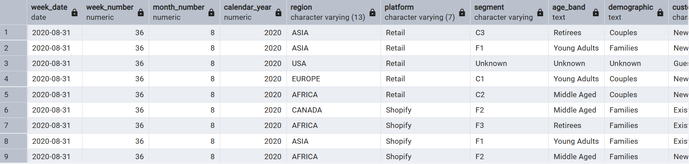

**Explanation:**
This query transforms the raw `weekly_sales` data into a clean and more usable format. It converts date strings to actual date types, extracts useful date parts like week and month, maps the cryptic `segment` column to human-readable `age_band` and `demographic` categories using `CASE` statements, and calculates the average transaction size for each record. The result is stored in a new table, `clean_weekly_sales`, for all subsequent analysis.

---

## B. Data Exploration

### 1. What day of the week is used for each week_date value?

#### Query

```sql

SELECT DISTINCT
  TO_CHAR(week_date, 'Day') AS day_of_week
FROM
  data_mart.clean_weekly_sales;
```


**Explanation:**

This query uses `TO_CHAR` to extract the full day name from the `week_date`. By selecting the `DISTINCT` values, we can see all unique days present in the dataset, confirming that all weekly data is recorded on the same day of the week.

---

### 2. What range of week numbers are missing from the dataset?

#### Query

```sql

WITH all_weeks AS (
  SELECT generate_series(1, 52) AS week_num
)
SELECT
  week_num AS missing_week_number
FROM
  all_weeks
WHERE
  week_num NOT IN (
    SELECT DISTINCT week_number
    FROM data_mart.clean_weekly_sales
  );
```

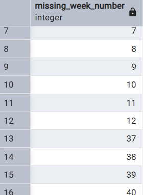

**Explanation:**
To find the missing weeks, we first generate a complete list of week numbers from 1 to 52. Then, we use a `NOT IN` clause to filter out the week numbers that are already present in our `clean_weekly_sales` table, leaving only the ones that are missing.

---

### 3. How many total transactions were there for each year in the dataset?

#### Query

```sql

SELECT
  calendar_year,
  SUM(transactions) AS total_transactions
FROM
  data_mart.clean_weekly_sales
GROUP BY
  calendar_year
ORDER BY
  calendar_year;
```

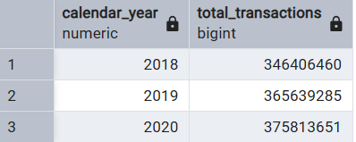

**Explanation:**
This query calculates the total number of `transactions` by summing the transactions column. The `GROUP BY calendar_year` clause ensures that we get a separate sum for each year in the dataset.

---

### 4. What is the total sales for each region for each month?

#### Query

```sql

SELECT
  region,
  month_number,
  SUM(sales) AS total_sales
FROM
  data_mart.clean_weekly_sales
GROUP BY
  region,
  month_number
ORDER BY
  region,
  month_number;
```

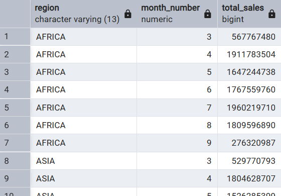

**Explanation:**
This query provides a breakdown of `sales` by both region and month. It sums the sales column and groups the results by `region` and `month_number` to get a detailed view of sales distribution.

---

### 5. What is the total count of transactions for each platform?

#### Query

```sql

SELECT
  platform,
  SUM(transactions) AS total_transactions
FROM
  data_mart.clean_weekly_sales
GROUP BY
  platform
ORDER BY
  platform;
```

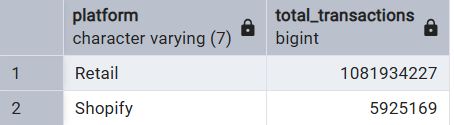

**Explanation:**
Similar to the previous queries, this sums the `transactions` column, but it groups the results by `platform` to show the total transaction volume for Retail versus Shopify.

---

### 6. What is the percentage of sales for Retail vs Shopify for each month?

#### Query

```sql

WITH monthly_platform_sales AS (
  SELECT
    month_number,
    platform,
    SUM(sales) AS platform_sales
  FROM
    data_mart.clean_weekly_sales
  GROUP BY
    month_number,
    platform
)
SELECT
  month_number,
  platform,
  ROUND(
    (platform_sales * 100.0) / SUM(platform_sales) OVER (PARTITION BY month_number),
    2
  ) AS sales_percentage
FROM
  monthly_platform_sales
ORDER BY
  month_number,
  platform;
```

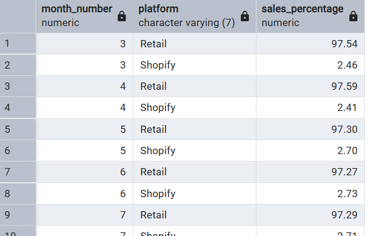

**Explanation:**
This query first calculates the total sales for each platform per month. It then uses a window function `SUM(...) OVER (PARTITION BY month_number)` to find the overall sales for each month, which serves as the denominator to calculate the percentage contribution of each platform.

---

### 7. What is the percentage of sales by demographic for each year in the dataset?

#### Query

```sql

WITH yearly_demographic_sales AS (
  SELECT
    calendar_year,
    demographic,
    SUM(sales) AS demographic_sales
  FROM
    data_mart.clean_weekly_sales
  GROUP BY
    calendar_year,
    demographic
)
SELECT
  calendar_year,
  demographic,
  ROUND(
    (demographic_sales * 100.0) / SUM(demographic_sales) OVER (PARTITION BY calendar_year),
    2
  ) AS sales_percentage
FROM
  yearly_demographic_sales
ORDER BY
  calendar_year,
  demographic;
```

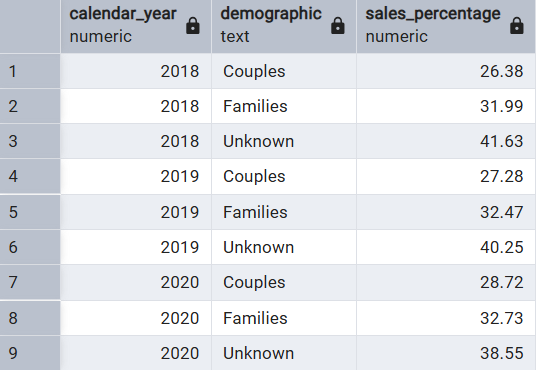

**Explanation:**
This query follows the same logic as the previous one but segments the data by `demographic` and `calendar_year` to determine the annual sales contribution of Couples, Families, and Unknown customer groups.

---

#### 8. Which age_band and demographic values contribute the most to Retail sales?

#### Query

```sql

SELECT
  age_band,
  demographic,
  SUM(sales) AS total_retail_sales
FROM
  data_mart.clean_weekly_sales
WHERE
  platform = 'Retail'
GROUP BY
  age_band,
  demographic
ORDER BY
  total_retail_sales DESC;
```

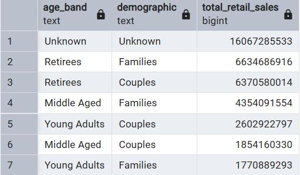

**Explanation:**
To find the top contributors, this query filters the data for `Retail` sales only, then groups by `age_band` and `demographic` to sum the sales for each combination. `ORDER BY ... DESC` ranks the results to show the highest contributors at the top.

---

#### 9. Can we use the avg_transaction column to find the average transaction size for each year for Retail vs Shopify? If not - how would you calculate it instead?

#### Query

```sql

SELECT
  calendar_year,
  platform,
  ROUND(AVG(avg_transaction), 2) AS incorrect_average,
  ROUND(SUM(sales)::NUMERIC / SUM(transactions), 2) AS correct_average
FROM
  data_mart.clean_weekly_sales
GROUP BY
  calendar_year,
  platform
ORDER BY
  calendar_year,
  platform;
```


**Explanation:**
This query demonstrates why you cannot average pre-calculated averages. The `incorrect_average` is a simple `AVG()` of the weekly averages, which is misleading. The `correct_average` is calculated by summing all sales over the period and dividing by the sum of all transactions, which is the mathematically sound method. The query shows both results side-by-side to highlight the difference.

## C. Before & After Analysis

#### 1. What is the total sales for the 4 weeks before and after 2020-06-15? What is the growth or reduction rate in actual values and percentage of sales?

#### Query

```sql

WITH date_details AS (
  SELECT
    DISTINCT week_number
  FROM data_mart.clean_weekly_sales
  WHERE week_date = '2020-06-15'
),
sales_comparison AS (
  SELECT
    SUM(CASE
          WHEN cs.week_number BETWEEN dd.week_number - 4 AND dd.week_number - 1 THEN cs.sales
          ELSE 0
        END) AS before_change_sales,
    SUM(CASE
          WHEN cs.week_number BETWEEN dd.week_number AND dd.week_number + 3 THEN cs.sales
          ELSE 0
        END) AS after_change_sales
  FROM data_mart.clean_weekly_sales AS cs
  CROSS JOIN date_details AS dd
  WHERE cs.calendar_year = 2020
)
SELECT
  before_change_sales,
  after_change_sales,
  (after_change_sales - before_change_sales) AS sales_difference,
  ROUND(
    (after_change_sales - before_change_sales)::NUMERIC * 100 / before_change_sales,
    2
  ) AS percentage_change
FROM sales_comparison;
```

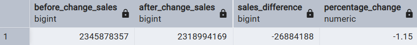

**Explanation:**
This query establishes the baseline week of the change (week 25) and uses conditional aggregation `(CASE WHEN)` to sum sales in the 4 weeks before (21-24) and the 4 weeks after (25-28). The final `SELECT` statement calculates the absolute and percentage difference between these two periods.

---

#### 2. What about the entire 12 weeks before and after?

#### Query

```sql

WITH date_details AS (
  SELECT
    DISTINCT week_number
  FROM data_mart.clean_weekly_sales
  WHERE week_date = '2020-06-15'
),
sales_comparison AS (
  SELECT
    SUM(CASE
          WHEN cs.week_number BETWEEN dd.week_number - 12 AND dd.week_number - 1 THEN cs.sales
          ELSE 0
        END) AS before_change_sales,
    SUM(CASE
          WHEN cs.week_number BETWEEN dd.week_number AND dd.week_number + 11 THEN cs.sales
          ELSE 0
        END) AS after_change_sales
  FROM data_mart.clean_weekly_sales AS cs
  CROSS JOIN date_details AS dd
  WHERE cs.calendar_year = 2020
)
SELECT
  before_change_sales,
  after_change_sales,
  (after_change_sales - before_change_sales) AS sales_difference,
  ROUND(
    (after_change_sales - before_change_sales)::NUMERIC * 100 / before_change_sales,
    2
  ) AS percentage_change
FROM sales_comparison;
```

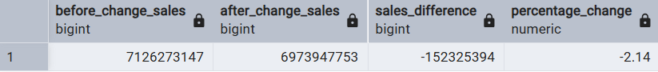

**Explanation:**
This query is a direct extension of the previous one. The only change is the time window, which has been expanded from 4 weeks to 12.

#### 3. How do the sale metrics for these 2 periods before and after compare with the previous years in 2018 and 2019?

#### Query

```sql

WITH yearly_comparison AS (
  SELECT
    calendar_year,
    -- 4-Week SUMS (Weeks 21-24 vs 25-28)
    SUM(CASE WHEN week_number BETWEEN 21 AND 24 THEN sales ELSE 0 END) AS sales_4wk_before,
    SUM(CASE WHEN week_number BETWEEN 25 AND 28 THEN sales ELSE 0 END) AS sales_4wk_after,

    -- 12-Week SUMS (Weeks 13-24 vs 25-36)
    SUM(CASE WHEN week_number BETWEEN 13 AND 24 THEN sales ELSE 0 END) AS sales_12wk_before,
    SUM(CASE WHEN week_number BETWEEN 25 AND 36 THEN sales ELSE 0 END) AS sales_12wk_after
  FROM
    data_mart.clean_weekly_sales
  GROUP BY
    calendar_year
)
SELECT
  calendar_year,
  -- 4-Week Percentage Change
  CONCAT(
    ROUND((sales_4wk_after - sales_4wk_before)::NUMERIC / sales_4wk_before * 100, 2),
    '%'
  ) AS pct_change_4wk,

  -- 12-Week Percentage Change
  CONCAT(
    ROUND((sales_12wk_after - sales_12wk_before)::NUMERIC / sales_12wk_before * 100, 2),
    '%'
  ) AS pct_change_12wk
FROM
  yearly_comparison
ORDER BY
  calendar_year;
```

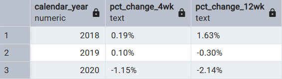

**Explanation:**
This query calculates the before and after sales changes for both 4-week and 12-week periods, but groups the results by `calendar_year`. This allows us to compare the sales trends in 2020 to the same time periods in 2018 and 2019 to see if the change had a noticeable impact beyond normal seasonal variations.

## D. Bonus Question

### Which areas of the business have the highest negative impact in sales metrics performance in 2020 for the 12 week before and after period?

#### Region Analysis Query

```sql

WITH sales_comparison AS (
  SELECT
    region,
    SUM(CASE WHEN week_number BETWEEN 13 AND 24 THEN sales ELSE 0 END) AS before_sales,
    SUM(CASE WHEN week_number BETWEEN 25 AND 36 THEN sales ELSE 0 END) AS after_sales
  FROM data_mart.clean_weekly_sales
  WHERE calendar_year = 2020
  GROUP BY region
)
SELECT
  region,
  ROUND((after_sales - before_sales)::NUMERIC / before_sales * 100, 2) AS percentage_change
FROM sales_comparison
WHERE before_sales > 0
ORDER BY percentage_change ASC;
```

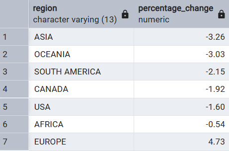

**Explanation:**
This query groups the "before" and "after" sales totals by region. Its purpose is to identify which specific geographical markets saw a positive or negative sales trend following the packaging change, allowing you to see if the impact was localized or widespread.

---

#### Platform Analysis Query

```sql

WITH sales_comparison AS (
  SELECT
    platform,
    SUM(CASE WHEN week_number BETWEEN 13 AND 24 THEN sales ELSE 0 END) AS before_sales,
    SUM(CASE WHEN week_number BETWEEN 25 AND 36 THEN sales ELSE 0 END) AS after_sales
  FROM data_mart.clean_weekly_sales
  WHERE calendar_year = 2020
  GROUP BY platform
)
SELECT
  platform,
  ROUND((after_sales - before_sales)::NUMERIC / before_sales * 100, 2) AS percentage_change
FROM sales_comparison
WHERE before_sales > 0
ORDER BY percentage_change ASC;
```

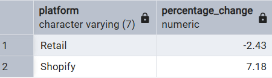

**Explanation:**
This query groups the sales data by `platform`. It directly compares the performance of the Retail versus Shopify channels to determine if online customers reacted differently to the change than in-store customers.

---

#### Age Analysis Query

```sql

WITH sales_comparison AS (
  SELECT
    age_band,
    SUM(CASE WHEN week_number BETWEEN 13 AND 24 THEN sales ELSE 0 END) AS before_sales,
    SUM(CASE WHEN week_number BETWEEN 25 AND 36 THEN sales ELSE 0 END) AS after_sales
  FROM
    data_mart.clean_weekly_sales
  WHERE
    calendar_year = 2020
  GROUP BY
    age_band
)
SELECT
  age_band,
  ROUND((after_sales - before_sales)::NUMERIC / before_sales * 100, 2) AS percentage_change
FROM
  sales_comparison
WHERE
  before_sales > 0
ORDER BY
  percentage_change ASC;
```

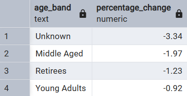

**Explanation:**
This query segments the analysis by `age_band`. The goal is to see how different generations (Young Adults, Middle Aged, Retirees) responded to the new packaging, helping to determine if the change appealed more to one age group than another.

#### Demographic Analysis Query

```sql

WITH sales_comparison AS (
  SELECT
    demographic,
    SUM(CASE WHEN week_number BETWEEN 13 AND 24 THEN sales ELSE 0 END) AS before_sales,
    SUM(CASE WHEN week_number BETWEEN 25 AND 36 THEN sales ELSE 0 END) AS after_sales
  FROM
    data_mart.clean_weekly_sales
  WHERE
    calendar_year = 2020
  GROUP BY
    demographic
)
SELECT
  demographic,
  ROUND((after_sales - before_sales)::NUMERIC / before_sales * 100, 2) AS percentage_change
FROM
  sales_comparison
WHERE
  before_sales > 0
ORDER BY
  percentage_change ASC;
```

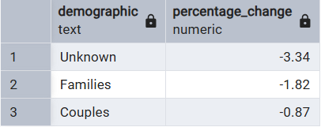

**Explanation:**
This query groups the sales figures by `demographic`. It's designed to measure the sales impact on Families versus Couples, providing insight into how different household types changed their purchasing behavior.

---

#### Customer Type Analysis Query

```sql

WITH sales_comparison AS (
  SELECT
    customer_type,
    SUM(CASE WHEN week_number BETWEEN 13 AND 24 THEN sales ELSE 0 END) AS before_sales,
    SUM(CASE WHEN week_number BETWEEN 25 AND 36 THEN sales ELSE 0 END) AS after_sales
  FROM
    data_mart.clean_weekly_sales
  WHERE
    calendar_year = 2020
  GROUP BY
    customer_type
)
SELECT
  customer_type,
  ROUND((after_sales - before_sales)::NUMERIC / before_sales * 100, 2) AS percentage_change
FROM
  sales_comparison
WHERE
  before_sales > 0
ORDER BY
  percentage_change ASC;
```

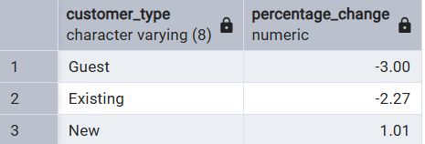

**Explanation:**
This query groups the data by `customer_type`. It breaks down the sales performance among New, Existing, and Guest customers to understand if the change helped attract new shoppers, alienated loyal ones, or affected infrequent visitors.

---

### Recommendations & Strategic Insights

Looking at the numbers, it seems the recent changes have created a mixed bag of results. While there are some clear areas of concern, there are also a couple of major bright spots that show us a potential path forward.

### 1. Double Down on Shopify and Europe

`The Insight`: The clearest wins are on our Shopify platform (+7.18%) and in the European market (+4.73%). While nearly every other part of the business shrank, these two areas grew significantly.

`The Recommendation`: We need to figure out why, and fast. Is the new sustainable packaging a bigger hit with online shoppers and European customers? Let's analyze the top-selling products in these segments and amplify our marketing efforts there. This is our growth engine right now.

### 2. Find the Root Cause of the Retail Decline

`The Insight`: Our core Retail channel took a hit (-2.43%), which dragged down sales from our most important customers: Existing (-2.27%) and Guests (-3.00%). The steepest declines were in Asia and Oceania.

`The Recommendation`: We need to diagnose the problem at the store level. Let's talk to store managers in our worst-performing regions. Was the new packaging not displayed well? Did it get negative feedback from our loyal shoppers? Understanding their perspective is crucial to fixing this.

### 3. Solve the "Unknown" Customer Mystery

`The Insight`: The "Unknown" demographic (-3.34%) is our worst-performing segment. This is a huge, risky blind spot in our business.

`The Recommendation`: We have to prioritize learning who these customers are. A simple loyalty program sign-up campaign (e.g., "Get 10% off today by creating an account") could give us the demographic data we desperately need to stop the bleeding in this segment.

### 4. Convert New Customers into Loyal Ones

`The Insight`: It's not all bad news! We're still successfully attracting New customers (+1.01%). These shoppers came to us after the change, so they're clearly on board with the new direction.

`The Recommendation`: Let's focus on keeping them. We should immediately target this group with a follow-up offer to encourage a second purchase. This is our chance to turn fresh interest into long-term loyalty and rebuild our base of "Existing" customers.
